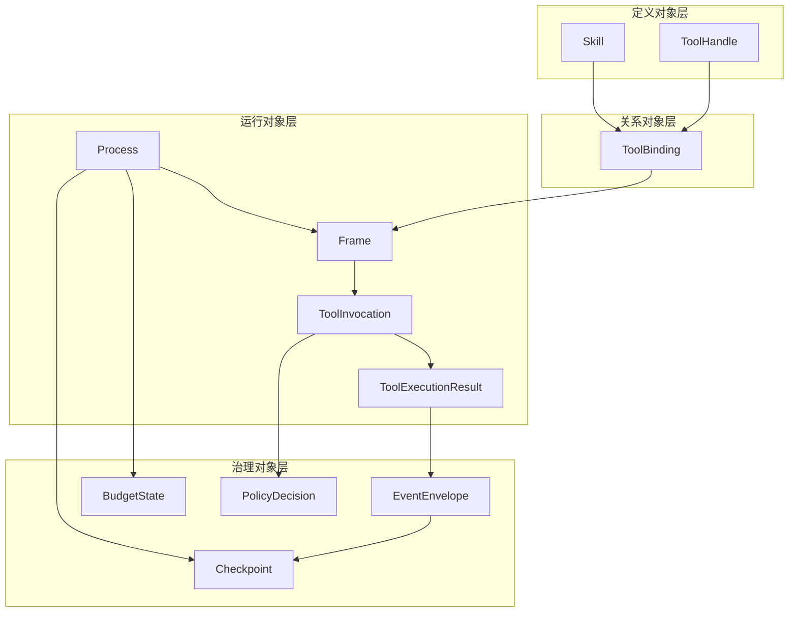
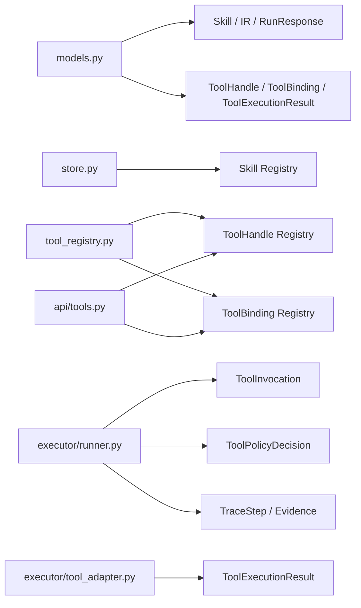
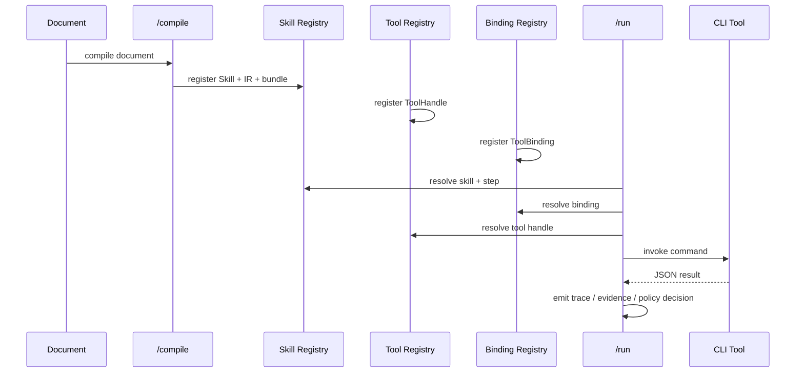
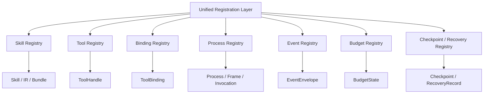

# Registration Object Model Diagram v0.1

本文档给出 `models.py + registry.py` 对应的统一注册对象模型设计图。  
目标：说明当前实现与目标态之间的对象分层、注册表分工与运行时流向。

---

## 1. 对象分层图

---

## 2. 当前代码映射图

---

## 3. 注册流向图

---

## 4. 目标态统一注册表

---

## 5. 设计说明

### 当前已具备

- Skill 注册
- ToolHandle 注册
- ToolBinding 注册
- ToolExecutionResult 结构化
- PolicyDecision 初步结构化

### 当前未完成

- Process Registry
- Event Registry
- Budget Registry
- Checkpoint Registry
- 统一的 registry API 聚合层

### 核心设计原则

1. 定义对象与运行对象分离
2. 注册表按层分工，不做平面大表
3. 关系对象必须显式注册
4. 治理对象最终必须具备独立注册能力

---

## 6. 一句话总结

这张图表达的核心不是“有哪些类”，而是：

> Skill、Tool、Binding、Process、Event、Budget、Checkpoint 如何通过注册体系被纳入同一个运行时秩序。
